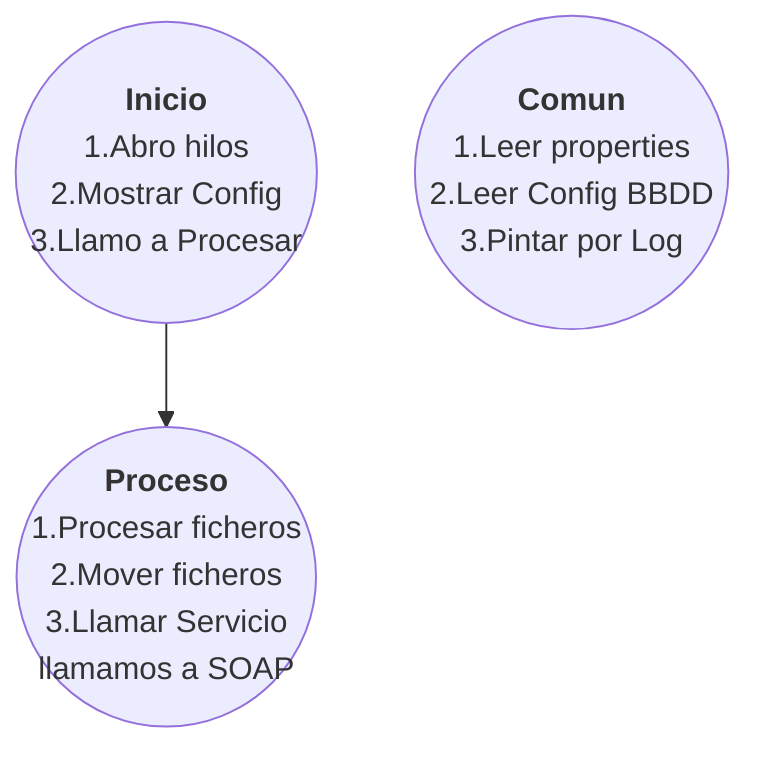

# Diagramas con Mermaid

```mermaid
graph TB
    %% Para editarlo https://mermaid-js.github.io/mermaid-live-editor
    ciInicio((<b>Inicio</b><br>1.Abro hilos<br>2.Mostrar Config<br>3.Llamo a Procesar ))
    ciProceso((<b>Proceso</b><br>1.Procesar ficheros<br>2.Mover ficheros<br>3.Llamar Servicio<br>llamamos a SOAP ))
    ciComun((<b>Comun</b><br>1.Leer properties<br>2.Leer Config BBDD<br>3.Pintar por Log))

    ciInicio --> ciProceso
```

