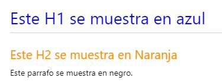
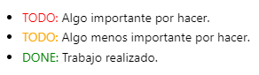

# Poner tus porpios estilos

Github tiene deshabilitado el CSS.

Sobreescribir los estilos:
```html
<style>
H1{color:Blue}
H2{color:DarkOrange !important;}
p{color:Black !important;}
</style>

# Este H1 se muestra en azul
## Este H2 se muestra en Naranja
Este parrafo se muestra en negro.
```

 

```html
<style>
r { color: Red }
o { color: Orange }
g { color: Green }
</style>

- <r>TODO:</r> Algo importante por hacer.
- <o>TODO:</o> Algo menos importante por hacer.
- <g>DONE:</g> Trabajo realizado. 
```

 


# Texto en color con Latex

Latex son para equaciones pero podemos añadir color al texto. 
Sí es procesado por github.

```md
$\color{red}     Texto\ en\ color$
$\color{green}   Texto\ en\ color$
$\color{blue}    Texto\ en\ color$
$\color{cyan}    Texto\ en\ color$
$\color{magenta} Texto\ en\ color$
$\color{yellow}  Texto\ en\ color$
$\color{black}   Texto\ en\ color$
$\color{gray}    Texto\ en\ color$
$\color{white}   Texto\ en\ color$
$\color{darkgray}Texto\ en\ color$
$\color{lightgray}Texto\ en\ color$
$\color{brown}   Texto\ en\ color$
$\color{lime}    Texto\ en\ color$
$\color{olive}   Texto\ en\ color$
$\color{orange}  Texto\ en\ color$
$\color{pink}    Texto\ en\ color$
$\color{purple}  Texto\ en\ color$
$\color{teal}    Texto\ en\ color$
$\color{violet}  Texto\ en\ color$
```    

$\color{red}     Texto\ en\ color$

$\color{green}   Texto\ en\ color$

$\color{blue}    Texto\ en\ color$

$\color{cyan}    Texto\ en\ color$

$\color{magenta} Texto\ en\ color$

$\color{yellow}  Texto\ en\ color$

$\color{black}   Texto\ en\ color$

$\color{gray}    Texto\ en\ color$

$\color{white}   Texto\ en\ color$

$\color{darkgray}Texto\ en\ color$

$\color{lightgray}Texto\ en\ color$

$\color{brown}   Texto\ en\ color$

$\color{lime}    Texto\ en\ color$

$\color{olive}   Texto\ en\ color$

$\color{orange}  Texto\ en\ color$

$\color{pink}    Texto\ en\ color$

$\color{purple}  Texto\ en\ color$

$\color{teal}    Texto\ en\ color$

$\color{violet}  Texto\ en\ color$


# Texto en color con Placehold

Placehold es un servicio de imagenes. Nos puede devolver un texto de un color sobre el fondo de otro color. Funciona en github. Sí ponemos el texto y el fondo del mismo color, tenemos un cuadrado de color.

```md

```

 `f03c15 es rojo, tamaño 15x15`

 `#c5f015 es amarillo, tamaño 15x15`

 `#1589F0 es azul, tamaño 25x25`


```md

```

Saludamos en letra blanca (FFFFFF) fondo negro (000000) 


